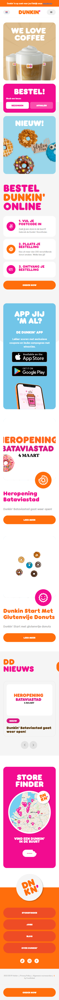
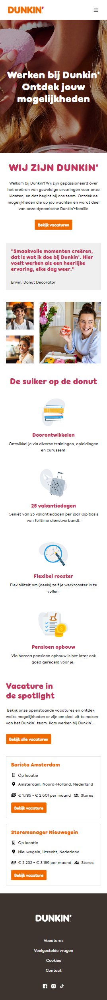

# Procesverslag
Markdown is een simpele manier om HTML te schrijven.  
Markdown cheat cheet: [Hulp bij het schrijven van Markdown](https://github.com/adam-p/markdown-here/wiki/Markdown-Cheatsheet).

Nb. De standaardstructuur en de spartaanse opmaak van de README.md zijn helemaal prima. Het gaat om de inhoud van je procesverslag. Besteedt de tijd voor pracht en praal aan je website.

Nb. Door *open* toe te voegen aan een *details* element kun je deze standaard open zetten. Fijn om dat steeds voor de relevante stuk(ken) te doen.

## Jij

  
uitwerken voor kick-off werkgroep

  ### Auteur:
  Aya Barni

  #### Je startniveau:
  Blauw piste

  #### Je focus:
  Surface plane
 

## Je website

  
uitwerken voor kick-off werkgroep

  ### Je opdracht:
  https://www.dunkin.nl/

  #### Screenshot(s) van de eerste pagina (small screen): 
  hier de naam van de pagina  
  

  #### Screenshot(s) van de tweede pagina (small screen):
  hier de naam van de pagina  
  
 

## Toegankelijkheidstest 1/2 (week 1)

  
uitwerken na test in 2e werkgroep

  ### Bevindingen
  Eerst testte ik de beperkte mogelijkheden. Ik begon met het testen van een bril met onscherpe glazen. Ik probeerde te typen met deze bril, maar ik kon nooit typen, maar lezen ging makkelijker dan typen, maar ik kon nog steeds moeilijk lezen. Het was als een blinddoek voor het oog.
  Daarna probeerde ik typen met elastiekjes.
  Ik kon typen terwijl mijn vingers gebonden waren, maar als ik de elastiekjes meer dan twee keer om mijn vingers wikkelde, kon ik mijn vingers nooit onder controle houden.
  Daarna heb ik de hand vibrator niet meer geprobeerd. Ik wilde gewoon zien hoe het de studenten beïnvloedde, want de hand bleef trillen en ik zag niemand van hen die kon typen als ze hun handen onder controle hadden.

  Toegankelijkheidstest:
  Screenreaders:
  Tijdens het testen van de toegankelijkheid gebruikte ik de schermlezer. Het geluid was goed en ook duidelijk, maar het las in het Engels en ik wist niet hoe ik de taal in de instellingen kon veranderen. 
  Ik kon navigeren tussen de koppen op de pagina, ik heb het een paar keer getest en het zei de koppen niet elke keer in de juiste volgorde.
  Ik kon ook door de links navigeren door op de letter k te drukken en elke link liet zien wat het bevatte.

   

## Breakdownschets (week 1)

  
uitwerken na afloop 3e werkgroep

  ### de hele pagina: 
  
  

  ### dynamisch deel (bijv menu): 
  <!--  -->

  ### wellicht nog een dynamisch deel (bijv filter): 
  <!--  -->

## Voortgang 1 (week 2)

  
uitwerken voor 1e voortgang

  ### Stand van zaken
  hier dit ging goed & dit was lastig (neem ook screenshots op van delen van je website en code)

  ### Agenda voor meeting
  samen met je groepje opstellen

| Thomas     | Braham         | Aya    | Joy        |
  | ---            | ---                | ---          | ---              |
  | Hoe maken we vormen? Met vector of images?  | Hoe zit een Carroussel in elkaar?             | Kloppen onze breakdownschetsen?    | Wat is de beste manier om een video te embedden?    |
  | Hoe maak je een progressiebalk bij een carroussel? | Hoe maak je een hamburgermenu met animatie zonder images te gebruiken? | Waar precies moet je div gebruiken en waar een class? | Is onze HTML zo oké & correct? |

  ### Verslag van meeting
  hier na afloop snel de uitkomsten van de meeting vastleggen

  - punt 1
  - punt 2
  - nog een punt
  - ...

## Voortgang 2 (week 3)

  
uitwerken voor 2e voortgang

  ### Stand van zaken
  hier dit ging goed & dit was lastig (neem ook screenshots op van delen van je website en code)

  ### Agenda voor meeting
  samen met je groepje opstellen

| Thomas      | Braham          | Aya    | Joy        |
  | ---            | ---                | ---          | ---              |
  | Hoe zorg ik dat mijn header van kleur verandert, als ik voorbij een bepaald punt op mijn pagina ben?  | Hoe krijg ik de pijl van de details element aan de andere kant van de summary?    | hoe zorg ik dat een deel van de header vast blijven tijdnes het scrollen (position: fixed en sticky niet gewerkt)  | en dan ik dat    |
  | Is het echt verkeerd om dingen te positionen met paddings en margins?            | Moest je nou je hele main een class geven, of per element?              | Mijn elementen schuiven naar rechts toe en ik weet niet waar ik een fout heb staan in de code. Alles staat scheef hellup!!!!          | ...              |

  ### Verslag van meeting
  hier na afloop snel de uitkomsten van de meeting vastleggen

  - punt 1
  - punt 2
  - nog een punt
- ...

## Toegankelijkheidstest 2/2 (week 4)

  
uitwerken na test in 9e werkgroep

  ### Bevindingen
  Lijst met je bevindingen die in de test naar voren kwamen (geef ook aan wat er verbeterd is):

## Voortgang 3 (week 4)

  
uitwerken voor 3e voortgang

  ### Stand van zaken
  hier dit ging goed & dit was lastig (neem ook screenshots op van delen van je website en code)

  ### Agenda voor meeting
  samen met je groepje opstellen

  | student 1      | student 2          | student 3    | student 4        |
  | ---            | ---                | ---          | ---              |
  | dit bespreken  | en dit             | en ik dit    | en dan ik dat    |
  | en dat ook nog | dit als er tijd is | nog een punt | dit wil ik zeker |
  | ...            | ...                | ...          | ...              |

  ### Verslag van meeting
  hier na afloop snel de uitkomsten van de meeting vastleggen

  - punt 1
  - punt 2
  - nog een punt
  - ...

## Eindgesprek (week 5)

  
uitwerken voor eindgesprek

  ### Je uitkomst - karakteristiek screenshots:
  

  ### Dit ging goed/Heb ik geleerd: 
  Korte omschrijving met plaatjes

  

  ### Dit was lastig/Is niet gelukt:
  Korte omschrijving met plaatjes

  

## Surface plane
 1.Custom themes(kerst)
 2.Geluid(merry christmas liedje)
 3.Animaties(loading)
 4.Custom properties
 5.Scroll animaties

## Bronnenlijst

  
continu bijhouden terwijl je werkt

  Nb. Wees specifiek ('css-tricks' als bron is bijv. niet specifiek genoeg). 
  Nb. ChatGpT en andere AI horen er ook bij.
  Nb. Vermeld de bronnen ook in je code.

  1.  kerst boom icon/thema kerst 
  https://icon-sets.iconify.design/twemoji/christmas-tree/
  
  2. Kerst song
  https://www.youtube.com/watch?v=g-OF7KGyDis  

  3. Intro animatie werkte niet helemaal goed, waar alle letters in op één regel staan en de animatie werkt allen op de eerste letter
  https://chatgpt.com/c/6722784c-d8d4-8009-a3b3-a6fdb8efef68

  4. Tweede pagina: hier ind e eerste section moest ik een filter op de foto toevoegen maar de h2 keerg ook de filter mee
  https://chatgpt.com/c/6726221d-a870-8009-b15c-7ba2289024f4

  5. ik heb twee menus in dezelfde JS pagian ingezit maar ze werken niet want de biede menus hebben dezelfde funtion daardoor heb hun opgedeeld in twee aparte JS filles.
  https://chatgpt.com/c/672753ba-8e94-8009-b59d-6f87c4d2623a

  6. Dunkin fonts:
  https://www.onlinewebfonts.com/download/4ba6a0aa699286a040c28bf72ea53fa3
  https://convertio.co/nl/download/bc93dfc3fdec17afe29ebcb29408be453efcfc/

  7. Hier had pobleem met nemu knop, in het eerste pagina ik heb geen (aria-label)toegevoegd want ik dacht dat geen nuttig heeft.
  https://chatgpt.com/c/67211ad8-e770-8009-ac95-684eecc53592

  8. Kerst thema background. Ik heb hem ook in Figma een blur effect toegevoegd
  https://nl.pinterest.com/pin/57069120271792838/

